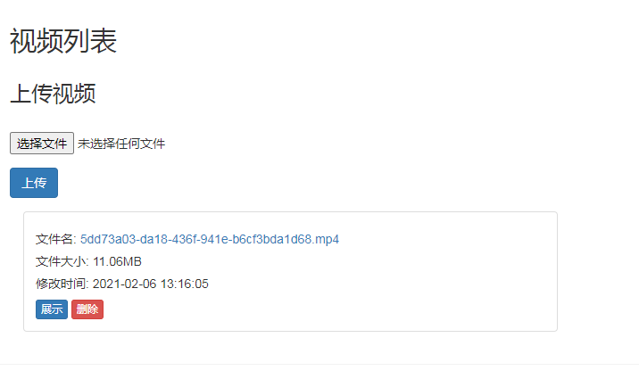

# 墨水屏相框

### 效果展示

-

-

-

### 材料清单
1. 树莓派\*1  
2. SD卡(树莓派用)\*1  
3. 电源适配器\*1    
4. 网线\*1  
5. 墨水屏(我用的是7.5寸微雪墨水屏)\*1  
6. 能装得下墨水屏的相框\*1 

### 准备树莓派
1. sd卡安装操作系统(我用的是Raspberry Pi OS lite版本, 在sd卡中新建一个名为SSH的文件可以默认开启ssh连接)
2. 将sd卡装到树莓派上, 插上网线, 并连接电源开机, 在路由器后台可以看到树莓派ip
3. ssh到树莓派, 传文件可用scp命令或其他图形化工具
4. 安装ffmpeg, 如果下载速度慢请更换源  
    **sudo apt-get update**  
    **sudo apt-get install ffmpeg**  

### 安装墨水屏
1. 连接驱动板与树莓派
2. 连接驱动板与屏幕
3. 驱动这个屏幕需要启用树莓派的SPI接口  
    **sudo raspi-config**  
    选择**Interfacing Options -> SPI -> Yes** 开启SPI接口
4. 安装驱动
    **git clone https://github.com/TomWhitwell/SlowMovie/**  
    **cd SlowMovie/e-paper/RaspberryPi&JetsonNano/python**  
    **sudo python3 setup.py install** (python版本问题请自行查阅资料)
5. 测试  
    **python3 examples/epd_7in5_V2_test.py** (选择对应屏幕的测试程序)
    如果一切正常屏幕将显示如下效果
    

### 安装本程序
1. 克隆本项目  
    **git clone git@github.com:xi-mad/frame.git**  
    **cd frame**  
2. 启动项目  
    **python3 app.py**
3. 浏览器访问, 地址为  
    **http://树莓派ip:5000/**
4. 设置开机启动
    编辑"**/etc/rc.local**"文件, 编辑文件可以用vim命令, 操作指令自己查阅  
    在exit 0 前添加启动命令增加"**nohup python3 /root/frame/app.py &**"注意设置正确的路径
5. 设置相框显示图片或视频

### 支持功能
1. 图片  
    支持展示自定义裁剪图片和上传图片, 注意图片比例
2. 视频  
    支持展示视频

### 程序功能截图

-

-

-

### 支持其他尺寸的屏幕
1. 修改/templates/image.html中109,110,115,116行图片裁剪大小
2. 修改app.py中29,30行宽高大小
